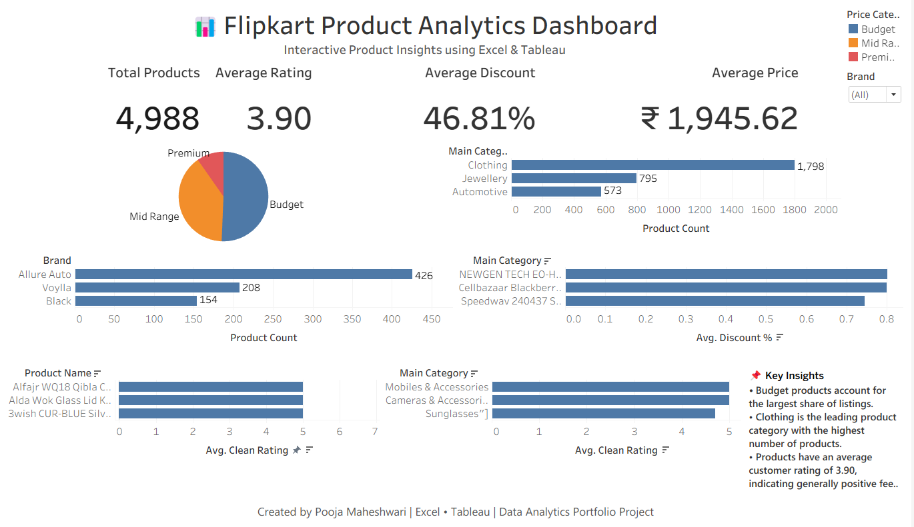

# 📊 Flipkart Product Analytics Dashboard

> Interactive Product Analytics Dashboard built using **Microsoft Excel** and **Tableau**.

---

## 📖 Project Overview

This project analyzes **4,988 Flipkart products** to uncover valuable insights into product categories, pricing, discounts, brands, and customer ratings. The dataset was cleaned and transformed using **Microsoft Excel**, followed by the creation of an interactive **Tableau dashboard** to support business analysis and decision-making.

The dashboard allows users to explore product performance through interactive filters and visualizations, helping identify pricing trends, category distribution, brand performance, discount patterns, and customer satisfaction.

---

## 🎯 Objectives

- Clean and transform raw Flipkart product data.
- Analyze product categories and brand distribution.
- Explore pricing and discount trends.
- Evaluate customer ratings.
- Build an interactive business dashboard using Tableau.

---

## 🛠️ Tools & Technologies

- Microsoft Excel
- Tableau
- Data Cleaning
- Data Validation
- Calculated Fields
- Interactive Dashboards

---

## 📊 Dashboard Features

### KPI Cards
- 📦 Total Products
- ⭐ Average Rating
- 💸 Average Discount
- 💰 Average Price

### Visualizations
- 📈 Category Analysis
- 🏷️ Brand Analysis
- 💸 Discount Analysis
- ⭐ Product Rating Analysis
- 🎯 Interactive Filters
- 📝 Business Insights Panel

---

## 📷 Dashboard Preview



---

## 📈 Key Insights

- 📦 Total Products Analyzed: **4,988**
- ⭐ Average Product Rating: **3.90**
- 💸 Average Discount: **46.81%**
- 💰 Average Listed Price: **₹1,945.62**
- 👕 Clothing is the largest product category by product count.
- 💼 Budget products account for the highest share of listings.
- 📱 Clothing and Mobile Accessories dominate the marketplace with a large number of products.

---

## 📂 Project Structure

```text
Flipkart-Product-Analytics-Dashboard/
│
├── Dashboard.png
├── Flipkart_Product_Analysis_5000.xlsx
├── Flipkart_Product_Analytics_Dashboard.twbx
└── README.md
```

---

## 🚀 Skills Demonstrated

- Data Cleaning & Preparation
- Exploratory Data Analysis (EDA)
- Dashboard Design
- Business Intelligence
- Data Visualization
- Interactive Dashboard Development
- Analytical Thinking

---

## 📌 Business Value

This dashboard enables stakeholders to:

- Monitor overall product performance.
- Compare categories and brands.
- Identify pricing and discount trends.
- Analyze customer ratings.
- Support data-driven business decisions.

---

## 👩‍💻 Author

**Heerakar Pooja Maheshwari**

**Aspiring Data Analyst**

**Skills:** SQL • Python • Microsoft Excel • Tableau • Power BI • Oracle Fusion

---

⭐ If you found this project useful, feel free to explore it and share your feedback!
